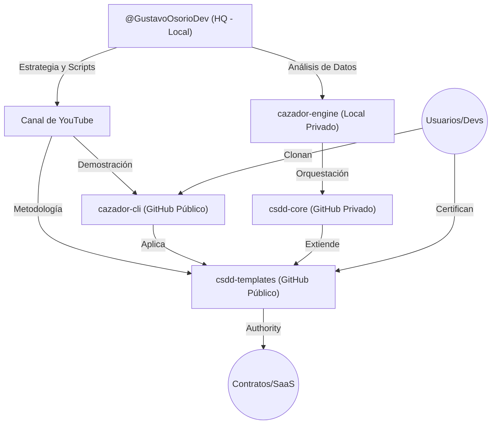

# Mapa del Ecosistema — @GustavoOsorioDev

Este mapa describe la relación entre los diferentes repositorios y workspaces definidos en la sesión del 16 de Junio de 2026.

## 📂 Directorios y Roles

### 1. Centro de Mando (HQ)
- **Ruta:** `@GustavoOsorioDev`
- **Rol:** Logística, guiones, SEO, estrategia del canal y de Antigravity.

### 2. Capa de Captación (Público)
- **Cazador CLI:** Herramienta táctica para que la comunidad encuentre sus propios nichos.
- **CSDD-Templates:** El estándar de ingeniería que define tu identidad técnica.

### 3. Capa de Operación (Privado)
- **Cazador Engine:** El motor "monstruo" que realmente encuentra los nichos donde tú vas a construir apps.
- **CSDD-Core:** La implementación privada de tus especificaciones de arquitectura.

## 🖥️ Especialización de Hardware (Pipeline)
- **RTX 2000 Ada (HQ):** Cerebro de desarrollo, escritura de código crudo y orquestación de agentes.
- **RTX 3060 Ti (Multimedia):** Automatización de post-producción (Whisper, transcripción, limpieza de audio).
- **RTX 4060 (Inferencia Local):** Motor de inferencia 24/7. Corre Qwen 2.5 Coder 7B para Nivel 0/1/2. Generación de B-Roll (ComfyUI).

---
*Mantenimiento: Actualizar este mapa al añadir nuevas micro-apps al ecosistema.*
